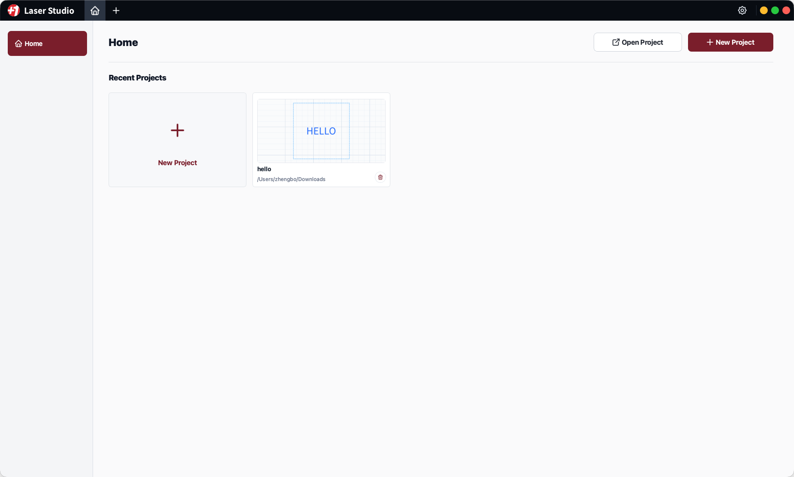
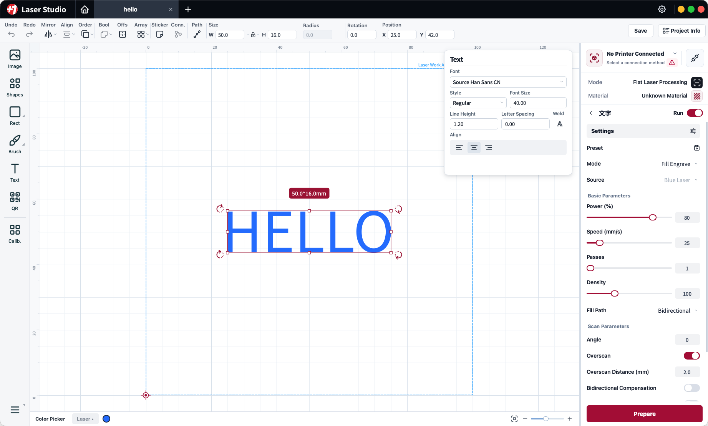
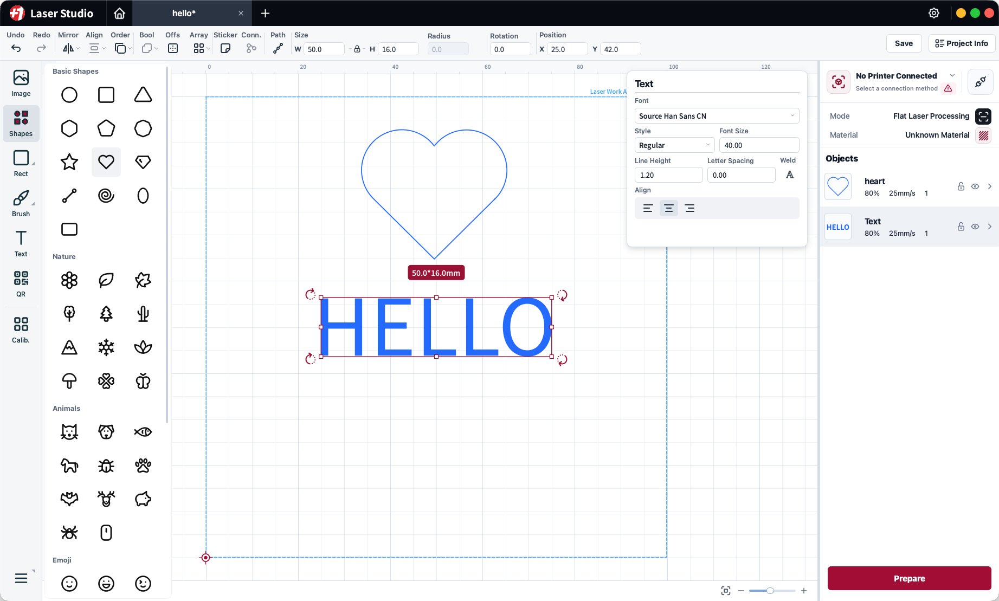
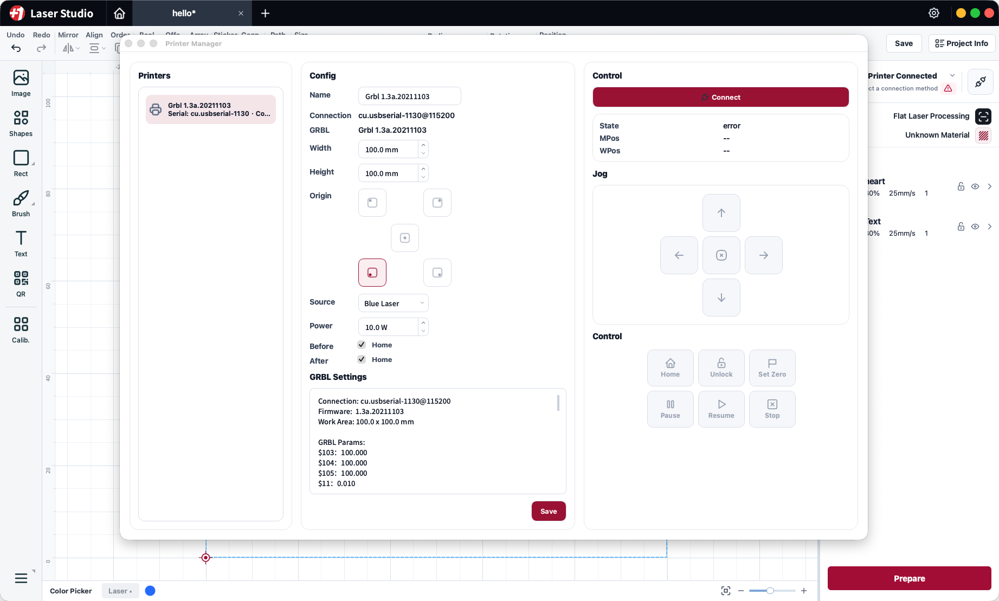
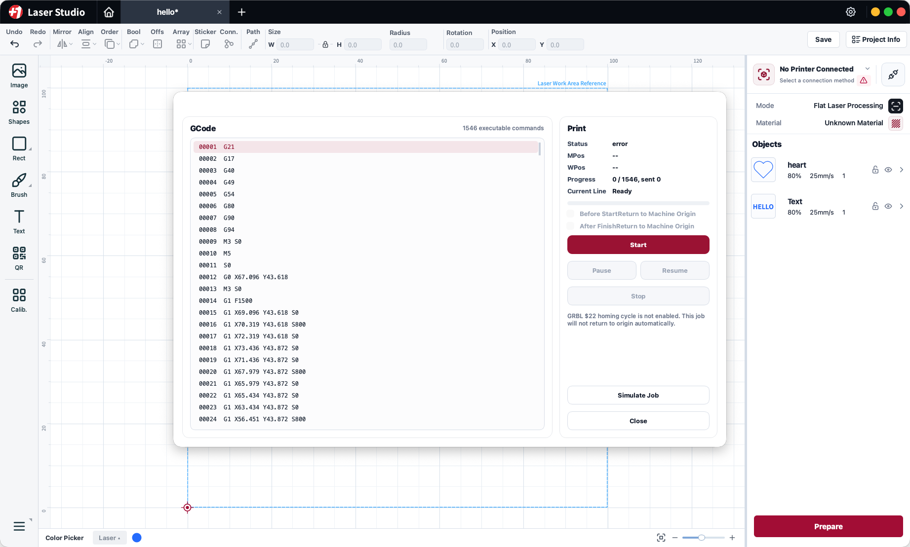
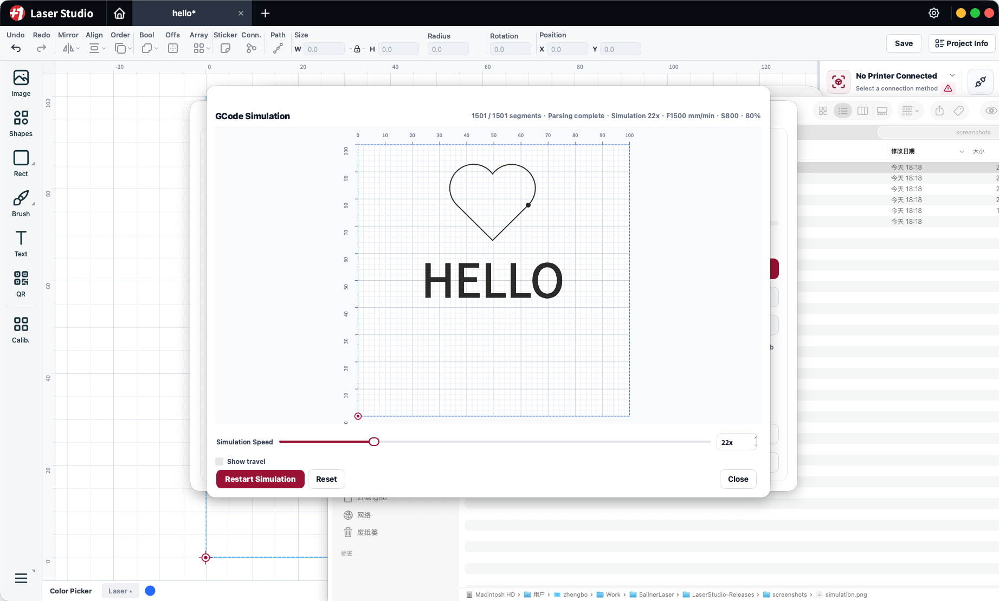

# Laser Studio

**バージョン: V0.9.2**

言語:

- [English](README.md)
- [简体中文](README.zh-CN.md)
- [繁體中文](README.zh-TW.md)
- [Deutsch](README.de.md)

Laser Studio は、レーザー彫刻とレーザー切断の作業を行うための無償デスクトップアプリです。

LightBurn は高機能で、LaserGRBL は軽量で実用的な選択肢です。それでも、現代的な編集ワークフローを備えた無償のレーザー加工ソフトはまだ多くありません。そこで、xTool のソフトウェアや Bambu Studio の実用的な考え方を参考に、プロジェクト管理、ビジュアル編集、機器設定、加工パラメータ、プレビュー、実行をひとつにまとめた無償のレーザー彫刻機向けアプリとして Laser Studio を開発しています。

現在の Laser Studio は、シリアル接続で G-code をストリーミング送信する GRBL 系の XY レーザー加工機を主な対象にしています。

## ダウンロード

実行ファイルは [releases](releases/) ディレクトリ、または GitHub Releases の添付ファイルとして公開されます。

推奨パッケージ名:

- `Laser-Studio-v0.9.2-macOS-arm64.dmg`
- `Laser-Studio-v0.9.2-macOS-x64.dmg`
- `Laser-Studio-v0.9.2-Windows-x64.exe`
- `Laser-Studio-v0.9.2-Windows-x64.zip`
- `Laser-Studio-v0.9.2-Linux-x64.AppImage`
- `checksums.txt`

## 主な機能

### プロジェクトワークフロー

- ローカルの Laser Studio プロジェクトを作成、開く、保存、再度開くことができます。
- ホーム画面の最近使ったプロジェクトカードから、前回の作業をすぐに再開できます。
- プロジェクトファイルには、編集可能なオブジェクト、作業エリア情報、サムネイル、加工プリセット、素材参照が保存されます。
- 現在のプロジェクト形式は `.lsproj` を中心に設計されており、編集用のプロジェクトデータと実行用のタスクデータは分離されています。

### ビジュアルエディタ

Laser Studio には、レーザー加工ジョブを準備するためのキャンバスベースのエディタが含まれています。

- ミリ単位の位置指定、ルーラー、ズーム操作、作業エリアへの自動フィットに対応したグリッド作業エリア。
- 位置、サイズ、回転、反転、整列、重なり順、レイアウト、オフセット、配列、パス操作などのオブジェクト編集。
- テキストオブジェクトは、フォントファミリー、スタイル、サイズ、行間、文字間隔、揃え、ウェルド設定に対応。
- 画像の読み込み、ベクターオブジェクト、パス、矩形、ブラシパス、QR コード、キャリブレーション用オブジェクト、接続点、内蔵図形素材を利用できます。
- オブジェクト一覧では、表示／非表示、ロック状態、順序、サムネイル、オブジェクトごとの加工設定を管理できます。

### 内蔵図形ライブラリ

左側のツールパネルには、すばやくデザインを作るための再利用可能な素材ライブラリがあります。現在のビルドには、基本的な幾何図形、自然モチーフ、動物、記号、ステッカー、アイコン風の素材が含まれています。

### 加工設定

各オブジェクトには、それぞれ個別のレーザー加工プリセットを割り当てられます。

対応している加工モード:

- 線彫刻
- 塗りつぶし彫刻
- 線切断
- 画像彫刻

加工パラメータには次の項目があります。

- レーザー光源の選択
- 出力、最小出力、最大出力
- `mm/s` 単位の加工速度
- 加工回数
- 塗りつぶし密度とライン間隔
- 塗りつぶし順序と塗りつぶしパスモード
- スキャン角度
- クロスハッチ
- Overscan
- 双方向補正
- ドウェル時間
- カーフ補正
- 切断用ブレークポイント
- 強化切断 / wobble cut パラメータ
- ラスター DPI と画像のドット時間
- 画像しきい値、Gamma、コントラスト、黒点、白点、ディザ強度、反転
- グレースケール、Blue Noise、Bayer、Floyd-Steinberg、Jarvis、Stucki、Atkinson、Sierra 系ディザリングなどの画像アルゴリズム

### 機器管理

Laser Studio は、GRBL 機器プロファイルとシリアル接続を管理できます。

- シリアルポートの検出と接続。
- 機器プロファイルの保存。
- 作業エリアの幅と高さの設定。
- 原点位置の選択。
- レーザー光源と出力の設定。
- GRBL 設定の表示。
- 機器状態、`MPos`、`WPos` の表示。
- ジョグ操作。
- 原点復帰、アンロック、作業原点設定、一時停止、再開、停止、レーザーオフの各コマンド。
- 機器がホーミングに対応している場合、ジョブの開始前後に原点へ戻す動作を選択できます。

### G-code プレビューと加工制御

ジョブを機器へ送信する前に、Laser Studio はプロジェクトを実行可能な G-code にコンパイルし、生成されたコマンド列を表示します。

- 行番号付きの G-code プレビュー。
- 大きなジョブでも扱いやすい表示行ウィンドウ。
- 実行中の現在行ハイライト。
- 開始、一時停止、再開、停止の制御。
- 機器状態と進捗の追跡。
- 作業エリア範囲と不正な加工設定に対する安全チェック。

### G-code シミュレーション

Laser Studio には G-code シミュレーション画面があり、機器へ送信する前に生成されたパスを確認できます。

- 作業エリア上でツールパスをシミュレーション。
- シミュレーション速度の調整。
- 空走経路の表示切り替え。
- 解析行の進捗と動作状態の表示。

## 現在の対象範囲

V0.9.2 では、デスクトップ上での編集と、XY レーザー加工機向けの GRBL シリアルストリーミング実行に重点を置いています。

現在の重点:

- ローカルプロジェクト編集
- GRBL 機器接続
- G-code 生成
- G-code プレビュー
- G-code シミュレーション
- PC 側でのストリーミング実行

今後または継続的に改善していく領域:

- より幅広い機器対応
- ネットワーク機器の検出
- コントローラ管理型のタスクパッケージ
- 材料ライブラリと加工プリセットの拡充
- インポート／エクスポート互換性の拡充

## ライセンス通知

Laser Studio は無償で利用できますが、プロプライエタリソフトウェアです。ソースコードは公開されません。

Laser Studio は Qt を使用しています。Qt は GNU LGPLv3、またはアプリケーションに含まれる Qt モジュールに適用されるオープンソースライセンスに基づいて提供されます。Laser Studio は Qt ライブラリを動的リンクしており、ユーザーは適用される Qt ライセンス条件に従って Qt 動的ライブラリを置き換え、または再リンクできます。

Qt のソースコードとライセンス情報:

- https://www.qt.io/
- https://www.qt.io/download-open-source
- https://www.gnu.org/licenses/lgpl-3.0.html

