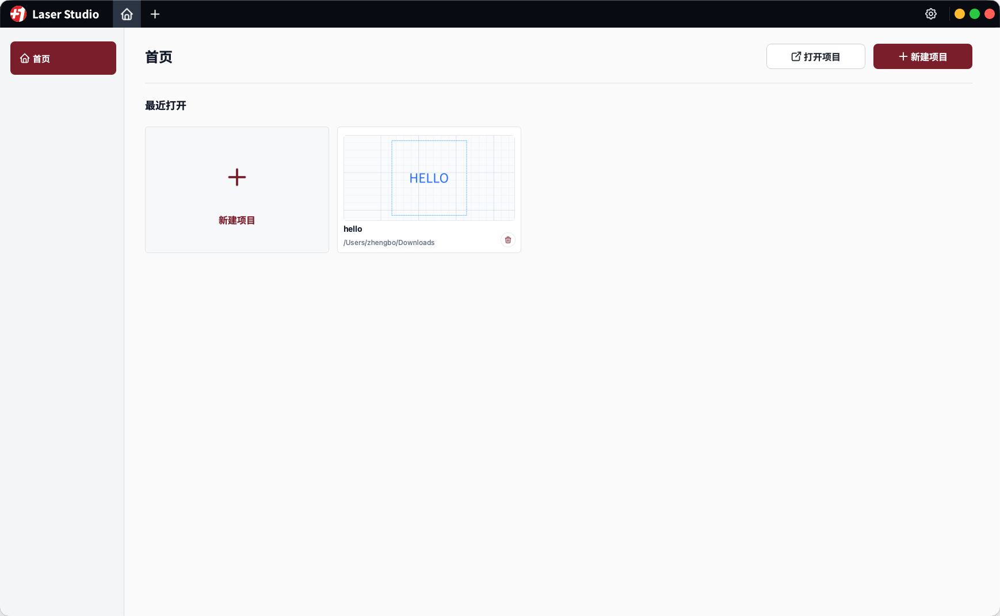
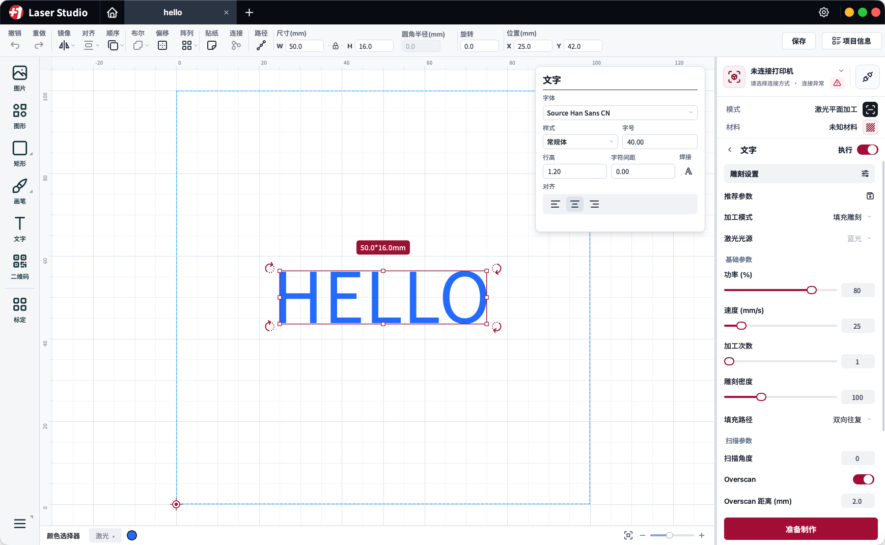
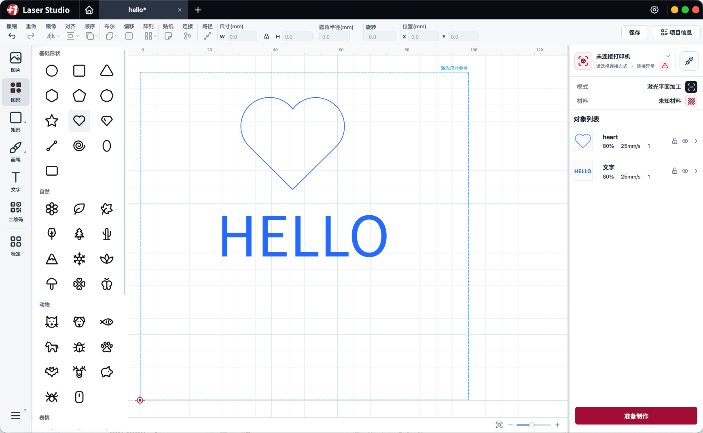
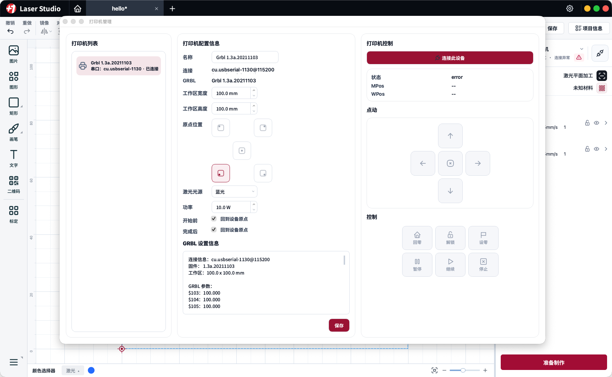
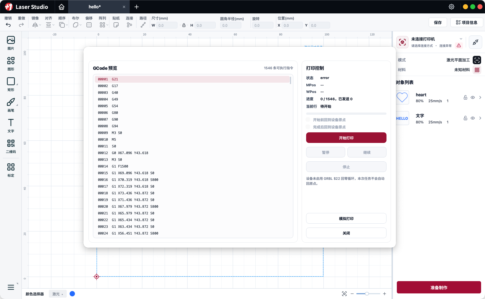
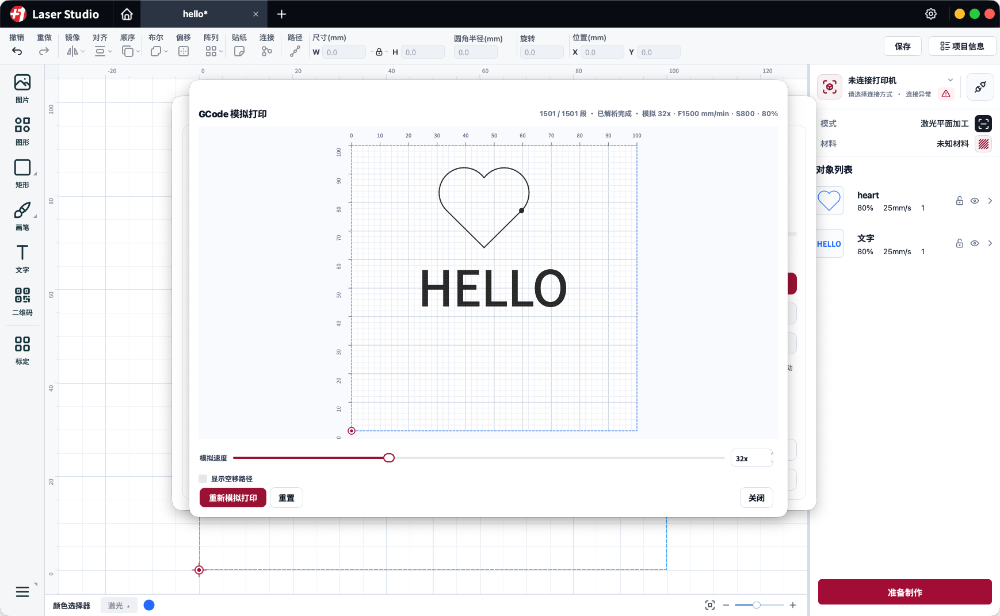

# Laser Studio

**版本：V0.9.2**

语言：

- [English](README.md)
- [繁體中文](README.zh-TW.md)
- [Deutsch](README.de.md)
- [日本語](README.ja.md)

Laser Studio 是一款免费的桌面激光雕刻与激光切割软件。

LightBurn 很强大，LaserGRBL 也是一个实用的轻量选择。我开始做 Laser Studio，是因为免费的激光软件选择仍然比较少，尤其是带有现代化编辑流程的软件更少。Laser Studio 的目标，是参考 xTool 软件和拓竹 Bambu Studio 中比较实用的工作流，把项目管理、可视化编辑、设备设置、工艺参数、预览和执行整合到一个免费软件里。

Laser Studio 当前主要面向通过串口 G-code 流式控制的 GRBL 类 XY 平台激光雕刻机。

## 下载

可执行文件会放在 [releases](releases/) 目录中，或作为 GitHub Releases 附件发布。

推荐安装包命名：

- `Laser-Studio-v0.9.2-macOS-arm64.dmg`
- `Laser-Studio-v0.9.2-macOS-x64.dmg`
- `Laser-Studio-v0.9.2-Windows-x64.exe`
- `Laser-Studio-v0.9.2-Windows-x64.zip`
- `Laser-Studio-v0.9.2-Linux-x64.AppImage`
- `checksums.txt`

## 主要功能

### 项目工作流

- 创建、打开、保存和重新打开本地 Laser Studio 项目。
- 首页最近项目卡片可以快速继续之前的工作。
- 项目文件会保存可编辑对象、工作区信息、缩略图、工艺预设和素材引用。
- 当前项目格式围绕 `.lsproj` 设计，编辑项目数据和任务执行数据是分开的。

### 可视化编辑器

Laser Studio 提供面向激光加工准备的画布编辑器。

- 带毫米定位、标尺、缩放控制和适配视图的网格工作区。
- 支持对象位置、尺寸、旋转、镜像、对齐、顺序、布局、偏移、阵列和路径操作。
- 文字对象支持字体、字形、字号、行高、字间距、对齐和焊接设置。
- 支持导入图片，创建矢量对象、路径、矩形、画笔路径、二维码、标定对象、连接点和内置图形素材。
- 对象列表支持可见性、锁定状态、顺序、缩略图和对象级工艺参数。

### 内置图形库

左侧工具栏包含可复用的素材库，适合快速制作图案。当前版本包含基础几何图形、自然图形、动物、符号、贴纸和图标类素材。

### 工艺参数

每个对象都可以设置独立的激光工艺预设。

支持的加工模式包括：

- 线雕
- 填充雕刻
- 线切割
- 图片雕刻

工艺参数包括：

- 激光光源选择
- 功率、最小功率、最大功率
- 加工速度，单位为 `mm/s`
- 加工次数
- 填充密度和线间距
- 填充顺序和填充路径
- 扫描角度
- 交叉填充
- Overscan
- 双向补偿
- 停顿时间
- 切缝补偿
- 切割断点
- 增强切割 / wobble cut 参数
- 栅格 DPI 和图片打点时间
- 图片阈值、Gamma、对比度、黑场、白场、抖动强度和反色
- 图片算法，包括灰度、蓝噪声、Bayer、Floyd-Steinberg、Jarvis、Stucki、Atkinson 和 Sierra 类抖动算法

### 打印机管理

Laser Studio 可以管理 GRBL 打印机配置和串口连接。

- 串口发现和连接。
- 保存打印机配置。
- 设置工作区宽度和高度。
- 设置原点位置。
- 配置激光光源和功率。
- 显示 GRBL 设置。
- 显示设备状态、`MPos` 和 `WPos`。
- 点动控制。
- 回原点、解锁、设置原点、暂停、继续、停止和关闭激光命令。
- 当设备支持回原点时，可选择任务开始前和完成后自动回到设备原点。

### G-code 预览和打印控制

发送任务到设备之前，Laser Studio 会把项目编译成可执行 G-code，并显示生成的命令流。

- 带行号的 G-code 预览。
- 大任务会使用可见行窗口，避免界面卡顿。
- 执行时高亮当前行。
- 开始、暂停、继续和停止控制。
- 设备状态和进度跟踪。
- 对工作区范围和无效工艺参数进行安全检查。

### G-code 模拟打印

Laser Studio 提供 G-code 模拟窗口，可以在发送到设备前检查生成的路径。

- 在工作区中模拟刀路。
- 可调模拟速度。
- 可选显示空移路径。
- 显示解析行进度和运动状态。

## 当前范围

V0.9.2 聚焦桌面编辑，以及面向 XY 激光雕刻机的 GRBL 串口流式执行。

当前重点：

- 本地项目编辑
- GRBL 设备连接
- G-code 生成
- G-code 预览
- G-code 模拟
- PC 端流式执行

计划中或持续完善的方向：

- 更广泛的设备支持
- 网络设备发现
- 控制器托管任务包
- 更多材料库和工艺预设
- 更多导入 / 导出兼容性

## 许可说明

Laser Studio 可以免费使用，但它是专有软件。源码不公开发布。

Laser Studio 使用 Qt。Qt 根据 LGPLv3 或对应 Qt 模块适用的开源许可提供。Laser Studio 动态链接 Qt 库，用户可以根据 Qt 适用许可条款替换或重新链接 Qt 动态库。

Qt 源码和许可信息：

- https://www.qt.io/
- https://www.qt.io/download-open-source
- https://www.gnu.org/licenses/lgpl-3.0.html

